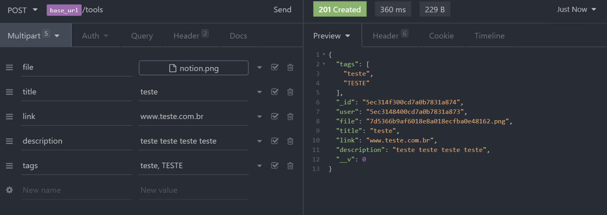
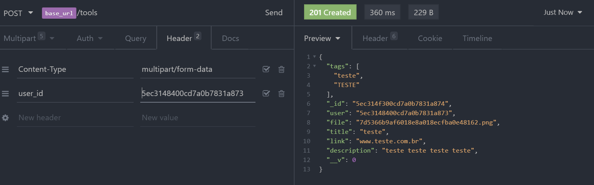
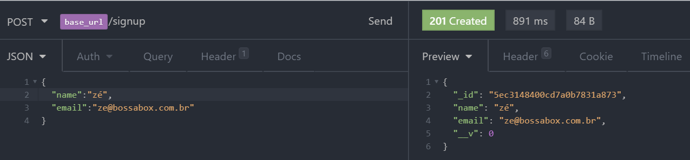
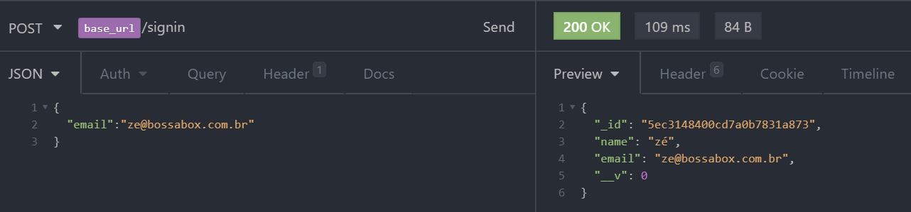

# Desafio BossaBox - API

## 💬 Sobre

A API tem como objetivo cadastrar ferramentas utilizadas no dia-a-dia de um desenvolvedor de softwares ou intusiastas de TI.

## ✔ Funcionalidades

- CRUD de ferramentas
  
  

- Criação de um usuário
  

- Autenticação simples com o e-mail
  

## 🛠 Ferramentas utilizadas

1. Express - Para a criação e utilização do servidor
2. Mongoose - ODM (objeto Document Mapper), utilizado para fazer as querys no BD.
3. Multer - Permiter trabalhar com multipart-formdata, possibilitando o envio de arquivos.
4. Cors - Cross-origin resource sharing, tem como principal objetivo restringir a utilização da API somente a Clients front-ends autorizados.
5. Nodemon - Fica monitorando as alteraçãoes no código e aplicando as mesmas em tempo real. Utilizado apenas como dependencia de desenvolvimento.
6. MongoBD - Banco de dados não-relacional, onde o mesmo encontra-se online no AtlasDB.
7. Swagger - Ferramenta para a criação da documentação mais detalhada sobre a API, expondo como utilizar as rotas e etc.

## 📝 Outros

Toda a documentação de como utilizar a API encontra-se aqui:
